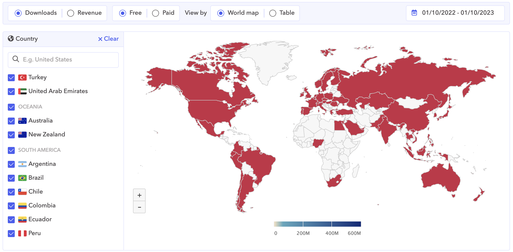
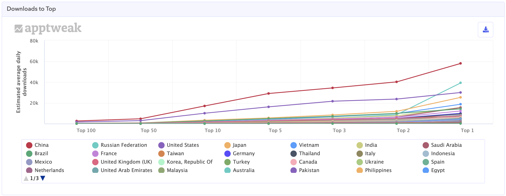

# App Download Data
All Top 100 to 1 App donwnload data from `apptweak.com` included more countries both App Store and Play Store for one year.

## Preview
|Map View |
|-----------|
||
|Chart View |
||
|Table View |
||

## App Store's App Categories:
- All Categories
- Books
- Business
- Developer Tools
- Education
- Entertainment
- Finance
- Food & Drink
- Graphics & Design
- Health & Fitness
- Lifestyle
- Magazines & Newspapers
- Medical
- Music
- Navigation
- News
- Photo & Video
- Productivity
- Reference
- Shopping
- Social Networking
- Sports
- Travel
- Utilities
- Weather

## Android's App Categories:
- All Categories
- Application
- Art & Design
- Auto & Vehicles
- Beauty
- Books & Reference
- Business
- Comics
- Communication
- Dating
- Education
- Entertainment
- Events
- Finance
- Food & Drink
- Health & Fitness
- House & Home
- Lifestyle
- Maps & Navigation
- Medical
- Music & Audio
- News & Magazines
- Parenting
- Personalization
- Photography
- Productivity
- Shopping
- Social
- Sports
- Tools
- Travel and Local
- Video Players
- Wear OS by Google
- Weather

## Game Categories:
- Game
- Games - Action
- Games - Adventure
- Games - Arcade
- Games - Board
- Games - Card
- Games - Casino
- Games - Casual
- Games - Educational
- Games - Music
- Games - Puzzle
- Games - Racing
- Games - Role playing
- Games - Simulation
- Games - Sports
- Games - Strategy
- Games - Trivia
- Games - Word

## Special thanks to Apptweak
Without apptweak that I can't get the data.

## Buy me coffee

